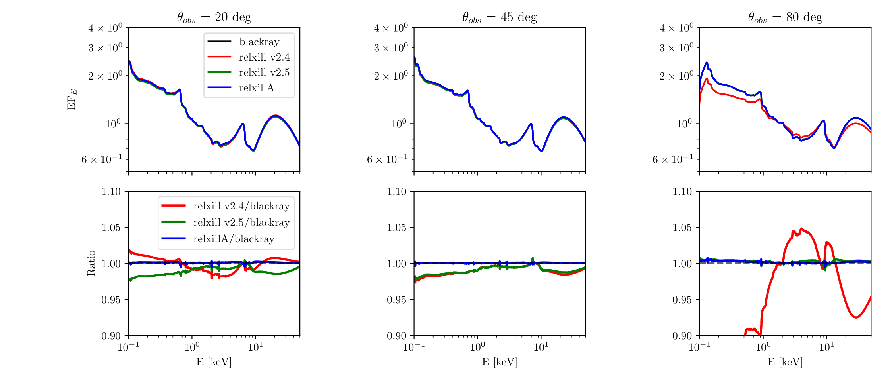

#  Installation

RelxillA is completely base on relxill ([García,Dauser et al](https://ui.adsabs.harvard.edu/abs/2014ApJ...782...76G)), please see and follow [relxill](http://www.sternwarte.uni-erlangen.de/~dauser/research/relxill/) for installation and more details.

# The properties of relxillA

RelxillA is an angle-improved relxill-type model which designed for next-generation instrument *NewAthena*/X-IFU and LAD. 

As show in [Huang et al (2025)](https://iopscience.iop.org/article/10.3847/1538-4357/adf111), relxillA simply improves the calculation of the emission angle and predicts slightly different spectra with respect to older models.Therefore it does not introduce any new parameter degeneracy. And relxillA can fit well the simulated observations of [Liu et al (2025)](https://academic.oup.com/mnras/article/536/3/2594/7922853).

## Emission angle we improved in relxillA

A key improvement in relxillA is its handling of the local emission spectrum. While relxill uses a single spectrum averaged over all emission angles, relxillA calculates the contribution from a series of discrete angular bins, as detailed in the following figure:

![Emission angle map as calculated by the ray-tracing code blackray (left panels) and by relxillA (right panels) when the black hole spin parameter is $\alpha$ = 0.998 and the inclination angle of the disk with respect to the line of sight of the observer is θ$_{obs}$ = 20$^\circ$ (top panels), 45$^\circ$ (central panels), and 80$^\circ$ (bottom
panels). The projection of the observer in the XY plane is at X = 0 and Y < 0. The black circle at the center of every panel is the region inside the ISCO, where there
is no emission.](figure/emissionmap.png)

## Comparsion between relxill and relxillA

## Simulation 
We showed that the approximations implemented in relxill and relxill_nk are unsuitable to fit high-quality full reflection spectra ([Liu et al (2025)](https://academic.oup.com/mnras/article/536/3/2594/7922853)), which require instead reflection models with more accurate calculations of the emission angle.

